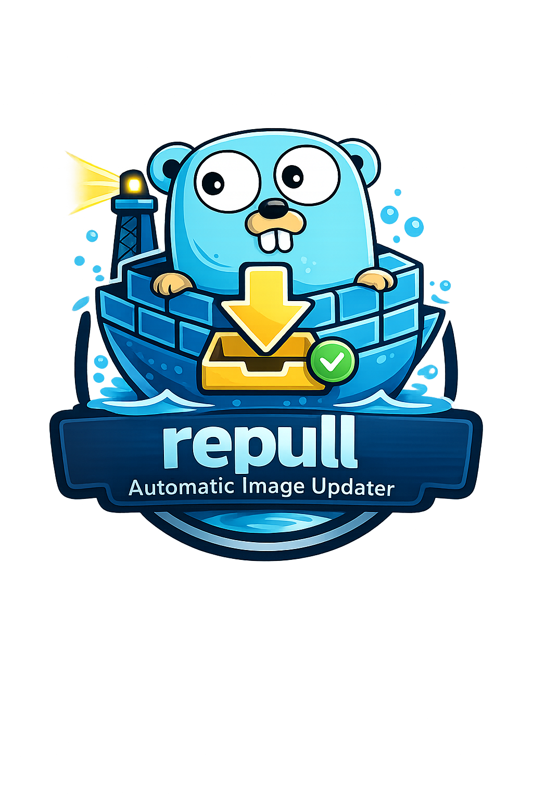

<div align="center">
  
</div>

# Repull

A minimal Docker container auto-updater, a Watchtower alternative. Automatically updates running containers when new images are available.

**Philosophy:** Keep It Simple, Stupid (KISS) - No web UI, no config files, no database.

**Why did i build this when so many other projects exists?** 
First of all, Watchtower was archived, so I needed a new way to automatically pull Docker image updates.Most of the other projects I found felt way more complex than what I wanted. I just wanted a small application that updates images to the latest version and sends a notification when it’s done.
So I started this project. The philosophy is to keep the application as small as possible, to avoid introducing security issues, and to only use the libraries I actually need. Right now it only depends on the Go Docker library, and I want to keep it that way.
I’m not a programming expert, so I also used help from Claude Code, Reddit, and Google to build this. I made this application mostly for fun. If you find a bug, please open an issue. If you want a new feature, you’ll probably want to fork it, as I don’t intend to make it more complex.
I use Renovate and govulncheck to keep dependencies up to date and to check for vulnerable or compromised packages. This is automated in my homelab, and I’ll release new versions when updates are needed. If you're a Go expert and notice any improvements or logical errors, please open an issue. I’d really appreciate the help.

## Features

- Opt-in only via `io.repull.enable=true` label
- Docker Compose aware (groups services correctly)
- Multi-network container support
- Preserves all container config (volumes, ports, networks, env vars, etc.)
- Interval or scheduled updates
- Discord webhook notifications
- Dry-run mode
- Single static binary, no dependencies

## Quick Start

### Docker Compose (as i run it in my homelab)

```yaml
services:
  repull:
    image: fanuelsen/repull:latest
    # or: ghcr.io/fanuelsen/repull:latest
    container_name: repull
    restart: unless-stopped
    volumes:
      - /var/run/docker.sock:/var/run/docker.sock:ro
    environment:
      REPULL_INTERVAL: "300"  # Check every 5 minutes
      # REPULL_SCHEDULE: "23:00"  # Or run daily at 11 PM
      # REPULL_DISCORD_WEBHOOK: "https://discord.com/api/webhooks/..."

  # Your app with auto-update enabled
  web:
    image: nginx:latest
    labels:
      io.repull.enable: "true"  # Enable auto-updates
    ports:
      - "80:80"
```

### Binary

Download from [GitHub Releases](https://github.com/fanuelsen/repull/releases):

```bash
chmod +x repull
sudo mv repull /usr/local/bin/

# Run once
repull

# Run every 5 minutes
repull --interval 300

# Run daily at 11 PM
repull --schedule 23:00
```

## Usage

### 1. Label Your Containers

Add `io.repull.enable=true` to containers you want auto-updated:

```yaml
services:
  app:
    image: myapp:latest
    labels:
      io.repull.enable: "true"
```

### 2. Run Repull

```bash
# Single check
repull

# Continuous (every 5 minutes)
repull --interval 300

# Scheduled (daily at specific time)
repull --schedule 23:00

# With Discord notifications
repull --interval 300 --discord-webhook "https://discord.com/api/webhooks/..."

# Dry-run (preview only)
repull --dry-run
```

## Configuration

| Flag | Env Variable | Description |
|------|--------------|-------------|
| `--interval N` | `REPULL_INTERVAL` | Run every N seconds (0 = single run) |
| `--schedule HH:MM` | `REPULL_SCHEDULE` | Run daily at specific time |
| `--discord-webhook URL` | `REPULL_DISCORD_WEBHOOK` | Discord webhook for notifications |
| `--dry-run` | `REPULL_DRY_RUN` | Preview changes without applying |
| `--docker-host HOST` | `DOCKER_HOST` | Docker daemon address |

**Note:** `--interval` and `--schedule` are mutually exclusive.

## How It Works

1. Lists all running containers
2. Filters for `io.repull.enable=true` label
3. Groups by Docker Compose service
4. Pulls latest image and compares digest
5. Recreates container if digest changed (preserving all config)

## Docker Images

- **Docker Hub:** `fanuelsen/repull:latest`
- **GitHub:** `ghcr.io/fanuelsen/repull:latest`

## Requirements

- Docker Engine (local or remote)
- Docker socket access (`/var/run/docker.sock`)

## Contributing

Want to add a web UI? Kubernetes support? GraphQL API? Please fork it instead. This project is intentionally minimal.
